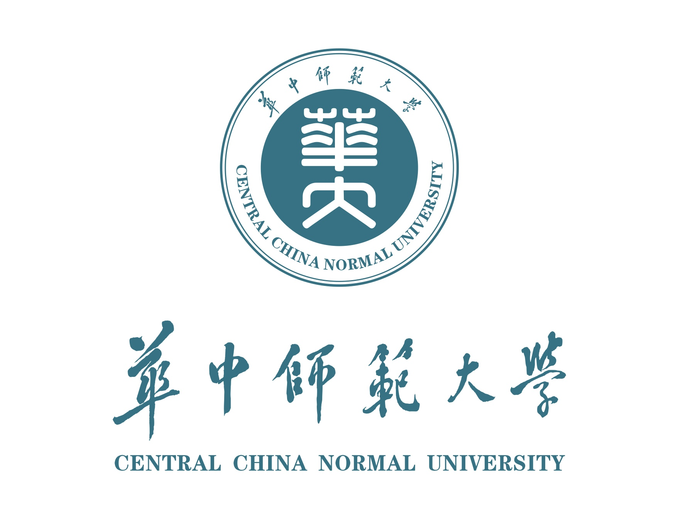

```{r setup, include=FALSE}
library(xaringanExtra)
library(xaringanthemer)

library(xaringanthemer)
library(xaringanthemer)
xaringanExtra::use_editable()
xaringanExtra::use_panelset()
xaringanExtra::use_clipboard()
xaringanExtra::use_tile_view()
xaringanExtra::use_tachyons()
xaringanExtra::use_share_again()
xaringanExtra::use_xaringan_extra()
xaringanExtra::use_search(show_icon = TRUE)
xaringanExtra::use_extra_styles(hover_code_line = T,mute_unhighlighted_code = T)

xaringanExtra::use_logo(image_url = "https://www.ccnu.edu.cn/__local/7/B7/24/0EA1E510D6F171BBEA51CFF88E8_A12ECAAB_5EDF.jpg",
link_url = "https://www.ccnu.edu.cn/",
position = xaringanExtra::css_position(top = "0.3em", right = "0.3em"),
width = "100px",height ="100px")


xaringanthemer::style_duo_accent(
  primary_color = "#1B7386",
  secondary_color = alpha("white"),
  code_font_family = "Menlo",
  code_inline_color = alpha("gold",0.8),
  text_slide_number_color = alpha("firebrick"),
  code_font_size = "15px"
  )
```


```{r xaringan-logo,echo = F}
xaringanExtra::use_logo(
  image_url = "https://www.ccnu.edu.cn/__local/7/B7/24/0EA1E510D6F171BBEA51CFF88E8_A12ECAAB_5EDF.jpg",
  link_url = "https://www.ccnu.edu.cn/",
  position = xaringanExtra::css_position(top = "0.3em", right = "1em"),
  width = "100px",height ="100px" 
)
```


<style>
  .title {
    border-radius:9px;
    border-bottom: 4mm ridge #FF6978;
  }
</style>


# 目录


```{r echo=FALSE,fig.align='center'}

```


---
# 1、招商引资


```{r echo=F}
xaringanExtra::style_panelset_tabs(
  active_foreground = "#0051BA",
  hover_foreground = "#d22"
)
```


#### 核心观点：优化营商环境属于一种制度创新，是政府履行经济发展职能的<span style='color:orange'>新型</span>方式（而传统方式是招商引资）。


.panelset[

.panel[.panel-name[1.1、招商引资的背景]
1978年改革开放之初，中国面临着僵化的计划经济体制、集体经济的意识形态、庞大而低效的国有企业。为打破传统的经济体制，建构现代市场，实现资本的原始积累，政府要不断地向市场和社会放权， 同时提供产权保护和必要的政策环境支持， 建设企业发展需要的公共产品。
]

.panel[.panel-name[1.2、招商引资的理论]

```{r echo=FALSE}

```

传统时期地方政府与企业的互动关系，主要是通过招商引资行为实现的，地方政府通过搭建经济发展的产业园，提供尽可能到位的服务和政策，吸引具有市场竞争力的潜在投资者。企业借助于政府的扶持，在市场竞争中占据政策优势，从而实现地区 GDP 的稳定增长，地方官员也通过高增长的经济指标成为官场竞争的胜出者。
]

.panel[.panel-name[1.3、招商引资的弊端]

在改革开放初期，因我国经济内生动力不足，市场和社会组织发育不成熟，解决了地方建设资金不足的问题，招商引资拉动了GDP高速增长，促进了产业结构调整，缓解了就业压力。但在肯定招商引资合理性和积极作用的基础上， 必须认识到招商引资所带来的一系列后果。例如：

- 唯GDP论，招商引资项目的过多、过滥；
- 官员以发展经济为由，利用手中权利寻租；
- 突破底线的政策扶持；
- 对破坏生态环境的默许；
- 产能效率低下的企业的引入，不利于产业结构转型；
- ...


<span style='color:red'>招商引资的本质依然是政府错位、越位和缺位的经济职能履行方式。 在国内、国际经济环境转变的背景下，政府应该逐步从招商引资的一线退出来，实现政府职能的归位，淡出招商引资的主体地位，变“政府招商”为“中介招商”或“企业招商”。</span>

]

]


---
# 2、营商环境


.panelset[

.panel[.panel-name[2.1、优化营商环境的意义]

40 余年过去，中国已经成为全球第二大经济体，经济发展进入新常态，廉价劳动力、大量土地供应、容忍环境破坏以及各种优惠政策带来的低成本优势逐步消退。传统地方政府围绕“经济增长”的竞争模式，随着国家与社会关系变化以及中央政府政策的调整，获取经济收益的空间正日益缩小，付出的成本却日益增高。

而有效的区域竞争依赖于如下因素：

- 地方政府保护其产品市场和设立贸易壁垒的能力；
- 地方政府对竞争压力反应决策的权威程度；
- 竞争者的多少；
- 履行契约和产品运输的成本等。

这些既是地方政府具有持续竞争力的核心因素，也是优化营商环境的政策制定导向。当今地方政府间的竞争已由依靠特殊优惠政策以低成本要素的单一策略，转变为建设政务环境、法治环境、市场环境以及国际化环境的综合博弈，优化营商环境已经成为提升地方政府治理体系和治理能力现代化的重要突破口、主抓手。

]

.panel[.panel-name[2.2、优化营商环境与招商引资的区别]
<br>

```{r echo=FALSE,out.width="70%",fig.align='center'}

```
]


]


---
# 2.3、基于制度变迁理论的分析


制度变迁意味着旧制度被否定、扬弃或改变，新制度得以建立或重新组合的过程。制度变迁理论主要是分析制度变迁过程中的：动力何在；制度要素间关系如何；变迁中的关键节点如何；何种变迁方式等。

```{r echo=FALSE,out.width="60%",fig.align='center'}


```


---
# 2.3、基于制度变迁理论的分析

.panelset[

.panel[.panel-name[变迁动因]

制度变迁动因构成制度变迁的核心内容，如果没有制度变迁动因，就无法产生制度变迁。根据诺斯理论，相对价格的变化和追求制度创新的收益是引起制度变迁的根本动力。

- 从相对价格来看：改革开放40余年，地方政府面临的经济环境和政治环境都发生重大改变，国内经济从单纯地注重速度向速度和质量兼顾发展，“反腐风暴”净化了党和国家的政治生态。

- 从追求制度创新收益来看：地方政府已经从“为增长而竞争”转变成“为创新而竞争”,制度创新已经成为新时期地方政府治理能力的重要体现。


```{r echo=FALSE,fig.align='center'}


```


]

.panel[.panel-name[变迁关系]

<br>
```{r echo=FALSE,fig.align='center'}


```


]


.panel[.panel-name[关键节点]

关键节点是制度变迁的重要基石，可以理解为历史发展中的转折时期，制度设计和重大决策的关键时刻，或者冲突爆发点、结构分歧点、能动选择点，对制度后期的发展轨迹具有重要影响。关键节点由特定时间和事件耦合而成，通过它向前能追寻原因和条件， 向后能推断方向和结果。


- 中央层面
  - 十八届三中全会最早提出营商环境，并指出要营造良好的营商环境。（2013）
  - “十三五”规划提出要优化营商环境，释放经济增长潜力（2015）
  - 李克强总理在全面深化“放管服”改革电话会议上指出“营商环境就是生产力”（2017-6）
  - 习近平总书记在中央财经领导小组第十六次会议上指出要“营造稳定公平透明、可预期的营商环境”（2017-7）
  - 国务院正式公布了中国优化营商环境领域的第一部综合性行政法规——《优化营商环境条例》（2019-10）

- 地方层面
  - 《广东省建设法治化国际化营商环境五年行动计划》（2012）
  - 《辽宁省优化营商环境条例》（2016）
  - 《上海市对标国际先进水平改善营商环境专项行动计划》（2017）
  - 《北京市进一步 优化营商环境行动计划》（2018）

]


.panel[.panel-name[变迁方式]

根据制度变迁的剧烈程度不同，制度变迁可以分为三种方式：

- 第一，制度功能变化。制度变迁与环境有关，外在环境发生变化，会影响制度功能的发挥，同一制度体系可能发挥与先前相反的功能。

- 第二，制度演进。制度产生之后，即使是制度处在路径依赖的正常周期内，也有可能出现制度自身的微调状况。

- 第三，制度断裂。社会经济环境的剧烈变化引发了巨大的新冲突，而原有的制度又在路径依赖的作用下进入闭锁状态失去了调适功能而不能容纳这种冲突时，就会导致原有制度出现断裂。

显然，从招商引资到优化营商环境制度演变方式为第二种，即制度即使发生变迁也不会与原有制度完全切断联系，而在一定程度上会保留既有制度要素形态或产生存续变形。


]

]


---

# 2.4、营商环境指标构建的思路

<br>


```{r echo=FALSE,fig.align='center'}

```


---
# 3、营商环境指标体系构建代表性文献


---
class:center inverse

# 感谢您的聆听！
### <span style='color:steelblue'>敬请批评指正</span>


```{r, echo=FALSE, fig.align='center', out.width='55%'}

```


